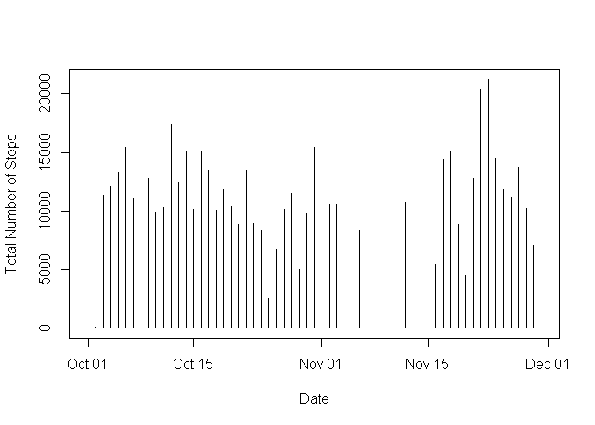
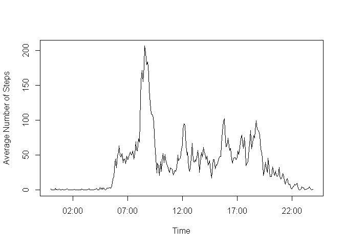
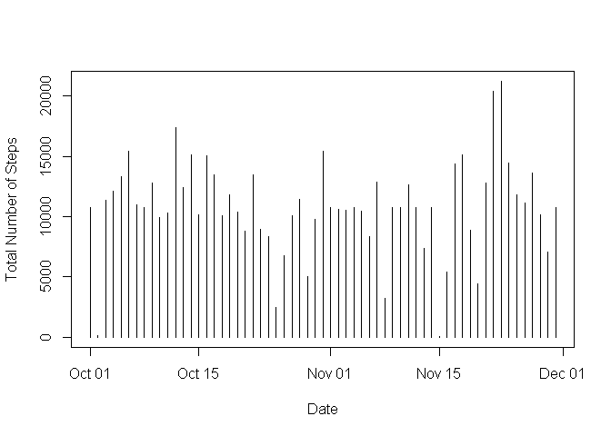
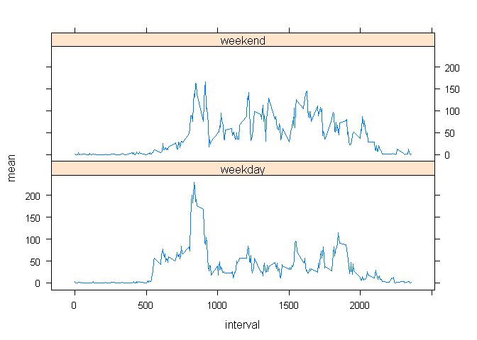

Loading and preprocessing the data
----------------------------------

1.Load the data

    download.file("https://d396qusza40orc.cloudfront.net/repdata%2Fdata%2Factivity.zip",destfile="data.zip")
    unzip("data.zip")
    read.csv("activity.csv",sep=",")->activity

2.Transform the data into a format suitable for analysis

    Sys.setlocale("LC_TIME", "English")

    ## [1] "English_United States.1252"

    activity$date<-as.Date(activity$date)
    head(activity)

    ##   steps       date interval
    ## 1    NA 2012-10-01        0
    ## 2    NA 2012-10-01        5
    ## 3    NA 2012-10-01       10
    ## 4    NA 2012-10-01       15
    ## 5    NA 2012-10-01       20
    ## 6    NA 2012-10-01       25

What is mean total number of steps taken per day?
-------------------------------------------------

1.Calculate the total number of steps taken per day

    library(dplyr)

    ## 
    ## Attaching package: 'dplyr'

    ## The following objects are masked from 'package:stats':
    ## 
    ##     filter, lag

    ## The following objects are masked from 'package:base':
    ## 
    ##     intersect, setdiff, setequal, union

    summarize(group_by(activity,date), sum=sum(steps,na.rm=T))->s
    head(s)

    ## # A tibble: 6 x 2
    ##         date   sum
    ##       <date> <int>
    ## 1 2012-10-01     0
    ## 2 2012-10-02   126
    ## 3 2012-10-03 11352
    ## 4 2012-10-04 12116
    ## 5 2012-10-05 13294
    ## 6 2012-10-06 15420

2.Make a histogram of the total number of steps taken each day.

    plot(as.Date(s$date),s$sum,type="h",xlab="Date",ylab="Total Number of Steps")

3.Calculate and report the mean and median of the total number of steps
taken per day.

    mean<-mean(s$sum,na.rm=T)
    median<-median(s$sum,na.rm=T)

The answer is

    c(mean,median)

    ## [1]  9354.23 10395.00

What is the average daily activity pattern?
-------------------------------------------

1.Make a time series plot of the 5-minute interval and the average
number of steps taken, averaged across all days.

    summarize(group_by(activity,interval), mean=mean(steps,na.rm=T))->m

    for(i in 1:nrow(m)){
      if(i<=12){
        paste("00",m[i,1],"00",sep=":")->m[i,1]
      }
      else if(i>12 & i<=120){
        paste(substr(m[i,1],1,1),substr(m[i,1],2,3),"00",sep=":")->m[i,1]
      }
      else{
        paste(substr(m[i,1],1,2),substr(m[i,1],3,4),"00",sep=":")->m[i,1]
      }
    }

    head(m)

    ## # A tibble: 6 x 2
    ##   interval      mean
    ##      <chr>     <dbl>
    ## 1  00:0:00 1.7169811
    ## 2  00:5:00 0.3396226
    ## 3 00:10:00 0.1320755
    ## 4 00:15:00 0.1509434
    ## 5 00:20:00 0.0754717
    ## 6 00:25:00 2.0943396

    strptime(m$interval,"%H:%M")->m$interval
    plot(m$interval,m$mean,type="l",xlab="Time",ylab="Average Number of Steps")

2.Which 5-minute interval, on average across all the days in the
dataset, contains the maximum number of steps?

    which.max(m$mean)->w
    unclass(m$interval[w])$hour->hour
    unclass(m$interval[w])$min->minute

The answer is

    if(hour<12){
      paste(paste(hour,minute,sep=":"),"AM")
    }else{
      paste(paste(hour,minute,sep=":"),"PM")
    }

    ## [1] "8:35 AM"

Imputing missing values
-----------------------

1.Calculate and report the total number of missing values in the
dataset.

    sum(is.na(activity$steps))

    ## [1] 2304

2.Devise a strategy for filling in all of the missing values in the
dataset.

I used the mean for that 5-minute interval.

3.Create a new dataset that is equal to the original dataset but with
the missing data filled in.

    summarize(group_by(activity,interval), mean=mean(steps,na.rm=T))->m
    activity->activity2

    for(i in 1:nrow(activity2)){
      if(is.na(activity2$steps[i])==T){
        which(activity2$interval[i]==m$interval)->n
        activity2$steps[i]<-m$mean[n]
      }
    }

    head(activity2)

    ##       steps       date interval
    ## 1 1.7169811 2012-10-01        0
    ## 2 0.3396226 2012-10-01        5
    ## 3 0.1320755 2012-10-01       10
    ## 4 0.1509434 2012-10-01       15
    ## 5 0.0754717 2012-10-01       20
    ## 6 2.0943396 2012-10-01       25

4.Make a histogram of the total number of steps taken each day and
Calculate and report the mean and median total number of steps taken per
day.

    summarize(group_by(activity2,date), sum=sum(steps))->s2
    plot(as.Date(s2$date),s2$sum,type="h",xlab="Date",ylab="Total Number of Steps")

The answer is

    mean2<-mean(s2$sum)
    median2<-median(s2$sum)
    c(mean2,median2)

    ## [1] 10766.19 10766.19

Do these values differ from the estimates from the first part of the
assignment?

Yes.

What is the impact of imputing missing data on the estimates of the
total daily number of steps?

The mean is equal to the median.

Are there differences in activity patterns between weekdays and weekends?
-------------------------------------------------------------------------

1.Create a new factor variable in the dataset with two levels –
“weekday” and “weekend” indicating whether a given date is a weekday or
weekend day.

    weekdays(activity2$date,abbreviate = T)->weekdays
    head(weekdays)

    ## [1] "Mon" "Mon" "Mon" "Mon" "Mon" "Mon"

    day<-integer(nrow(activity2))

    for(i in 1:nrow(activity2)){
      if(weekdays[i]=="Sat"|weekdays[i]=="Sun"){
        day[i]<-"weekend"
      }
      else{
        day[i]<-"weekday"
      }
    }

    as.factor(day)->day
    head(day)

    ## [1] weekday weekday weekday weekday weekday weekday
    ## Levels: weekday weekend

    cbind(activity2,day)->activity2
    head(activity2)

    ##       steps       date interval     day
    ## 1 1.7169811 2012-10-01        0 weekday
    ## 2 0.3396226 2012-10-01        5 weekday
    ## 3 0.1320755 2012-10-01       10 weekday
    ## 4 0.1509434 2012-10-01       15 weekday
    ## 5 0.0754717 2012-10-01       20 weekday
    ## 6 2.0943396 2012-10-01       25 weekday

2.Make a panel plot containing a time series plot of the 5-minute
interval and the average number of steps taken, averaged across all
weekday days or weekend days.

    aggregate(activity2$steps,by=list(activity2$interval,activity2$day),FUN="mean")->m2
    names(m2)<-c("interval","day","mean")
    head(m2)

    ##   interval     day       mean
    ## 1        0 weekday 2.25115304
    ## 2        5 weekday 0.44528302
    ## 3       10 weekday 0.17316562
    ## 4       15 weekday 0.19790356
    ## 5       20 weekday 0.09895178
    ## 6       25 weekday 1.59035639

    library(lattice)
    xyplot(mean~interval|day,data=m2,layout=c(1,2),type="l")

